# Safe Dispatch

**Safe, real-time Security-Constrained Economic Dispatch (SCED) on a 4-bus power system using a TD3 reinforcement-learning agent with a CVXPY/OSQP safety-projection layer.**

A trained Twin Delayed DDPG (TD3) policy proposes generator setpoints in **0.46 ms**; a quadratic-program safety layer projects every action onto the feasible operating set defined by power balance, generator limits, and PTDF-based thermal-line constraints. The result is a controller that is **32.1× faster than a traditional OSQP-based SCED solver** while remaining provably feasible and within a **4.24% average cost gap** of the optimum.

<p align="center">
  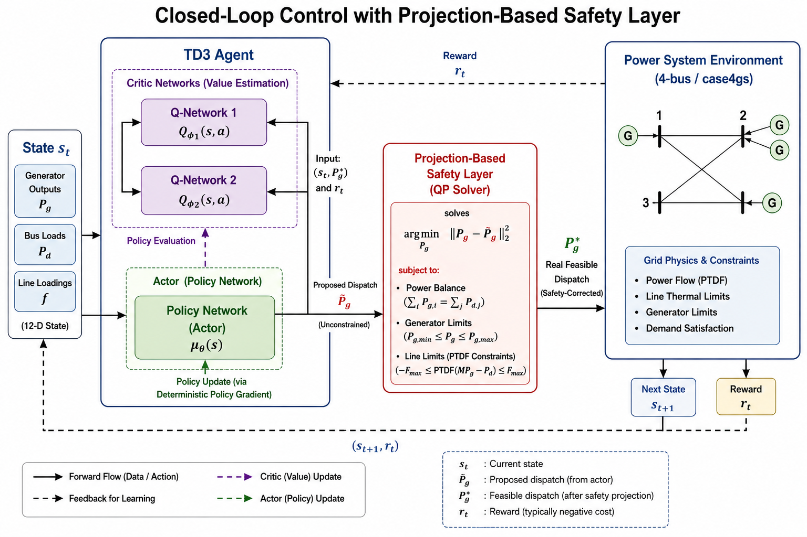
</p>

---

## Table of Contents

- [Motivation](#motivation)
- [System Overview](#system-overview)
- [Method](#method)
  - [Environment](#environment)
  - [Safety Projection Layer](#safety-projection-layer)
  - [TD3 Agent](#td3-agent)
  - [Reward Design](#reward-design)
- [Results](#results)
- [Repository Layout](#repository-layout)
- [Installation](#installation)
- [Usage](#usage)
- [Configuration Modes](#configuration-modes)
- [Authors](#authors)
- [References](#references)
- [License](#license)

---

## Motivation

Modern grids increasingly need sub-second dispatch decisions to absorb renewable variability, contingencies, and demand swings. Classical Security-Constrained Economic Dispatch is solved as a constrained quadratic program: optimal, but expensive and brittle when the problem must be re-solved at sub-second cadence.

**Safe Dispatch** asks: *can a learned policy match the optimizer's quality while being fast enough for real-time control, without sacrificing physical feasibility?* The answer demonstrated here is yes — provided the learner is wrapped with a lightweight feasibility projection that turns any proposed action into the closest feasible action.

## System Overview

The testbed is the **modified 4-bus `case4gs` system** (Grainger & Stevenson) with four generators (one slack, two cheap, one expensive), four loads, and four transmission lines. One line is intentionally tightened to create a recurring congestion bottleneck so that a purely cost-greedy dispatch is *not* feasible — the agent must learn to redispatch around the constraint.

<p align="center">
  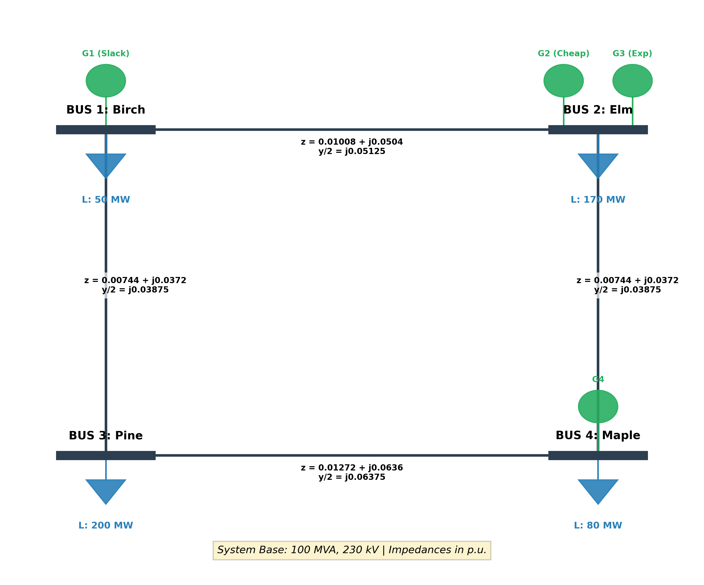
</p>

| Component | Value |
|---|---|
| Buses | 4 (Birch, Elm, Pine, Maple) |
| Generators | G1 (slack, Bus 0), G2 (cheap, Bus 1), G3 (expensive, Bus 1), G4 (Bus 3) |
| Lines | (0–1), (0–2), (1–3), (2–3) — line (1–3) is the bottleneck |
| Base | 100 MVA, 230 kV |
| Episode length | 100 steps with stochastic load drift |

## Method

### Environment

`PowerSystemEnv` (Gymnasium) implements DC power flow via the **Power Transfer Distribution Factor (PTDF) matrix**, computed once from the network susceptances:

- `B_bus = Aᵀ B_line A`
- `PTDF = B_line · A · B_bus⁻¹` (with the slack row/column removed before inversion)

State (12-D): generator outputs (4) ⊕ nodal demand (4) ⊕ per-line loading % (4).
Action (4-D, continuous): generator setpoints in `[-1, 1]`, rescaled to `[P_min, P_max]`.
Dynamics: per-step random load drift bounded in `±20%` of base demand.

### Safety Projection Layer

Every raw action proposed by the policy is projected to the nearest feasible point by solving a small QP at each step:

```
minimize    ‖Pg − Pg_rl‖²
subject to  Σ Pg = Σ Pd                        (power balance)
            P_min ≤ Pg ≤ P_max                  (gen limits)
            −F_max ≤ PTDF · (M·Pg − Pd) ≤ F_max (thermal limits)
```

Solved with OSQP via CVXPY. This guarantees that what is *actually* dispatched is always feasible, regardless of what the agent proposes. The training reward penalises the L1 gap between intent and projection, so the agent learns to propose feasible actions on its own.

### TD3 Agent

Standard Twin Delayed DDPG ([Fujimoto et al., 2018](https://arxiv.org/abs/1802.09477)) implemented in PyTorch — twin Q-networks (clipped double-Q), target policy smoothing, delayed actor updates, Polyak target updates.

<p align="center">
  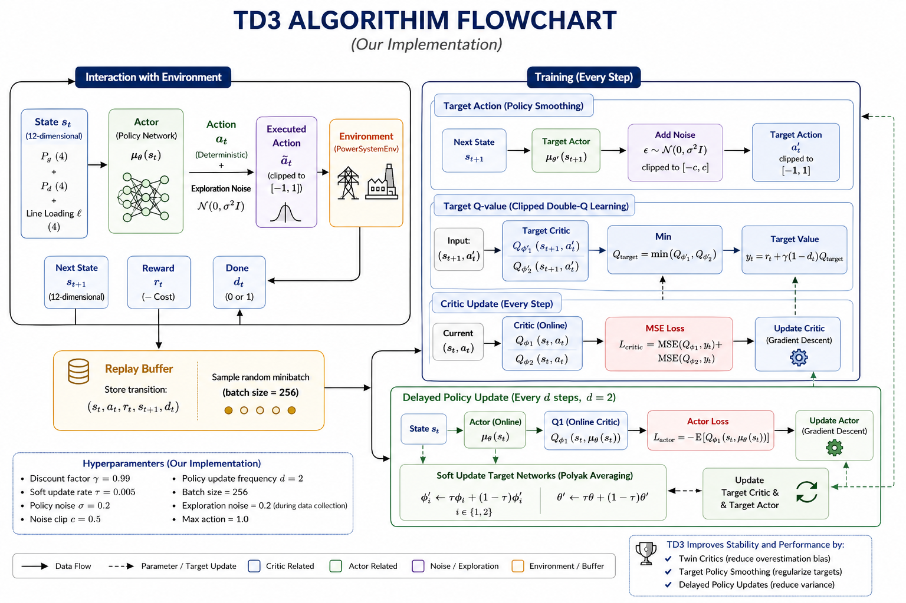
</p>

**Training hyperparameters**

| Parameter | Value | Parameter | Value |
|---|---|---|---|
| Max timesteps | 300,000 | Batch size | 256 |
| Discount γ | 0.99 | Target update τ | 0.005 |
| Policy noise σ | 0.2 | Noise clip c | 0.5 |
| Policy frequency f | 2 | Buffer size | 10⁶ |
| Exploration noise | 0.2 | Learning rate α | 3 × 10⁻⁴ |

### Reward Design

```
reward =  −tanh(actual_cost / 1000)         # economic efficiency
        − tanh(raw_violation / 50)          # constraint awareness
        − 5 · ‖Pg_safe − Pg_intended‖₁      # incentive to stay feasible
```

Each term is bounded, which is critical for stable Q-learning.

## Results

### Headline numbers (1,000-step benchmark vs. traditional OSQP solver)

| Metric | TD3 + Safety Layer | Traditional QP | Notes |
|---|---|---|---|
| Mean decision latency | **0.46 ms** | 14.63 ms | **32.1× speedup** |
| Avg cost gap vs. optimum | **+4.24%** | optimum (lower bound) | Near-optimal economically |
| Power-balance residual | **0%** across all steps | 0% | Both feasible by construction |
| Constraint violations | **0** post-projection | 0 | Both feasible by construction |
| Grid stability | **100%** | 100% | No load shedding observed |

### Training curves (3,000 episodes)

Training stabilises early (episode ≈ 49 hits the violation-mastery threshold) and stays steady for the remaining 2,950+ episodes — the bounded reward terms keep critic and actor losses well-behaved.

<p align="center">
  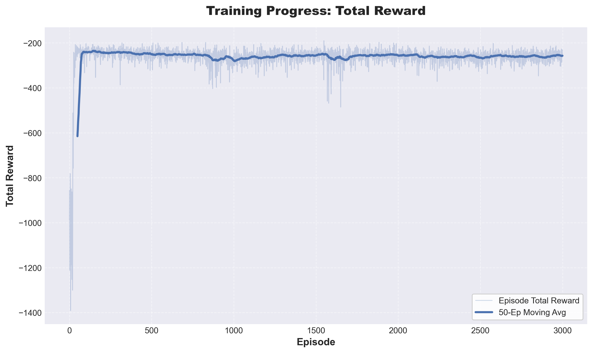
  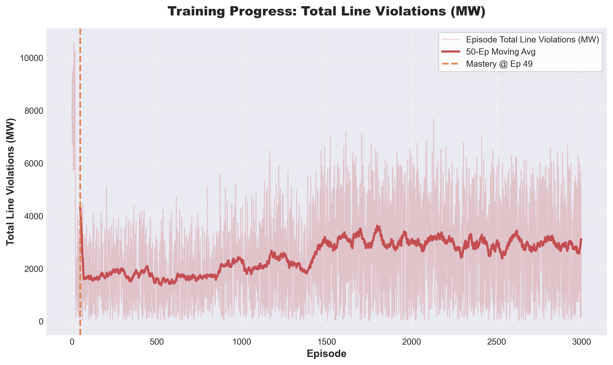
</p>

<p align="center">
  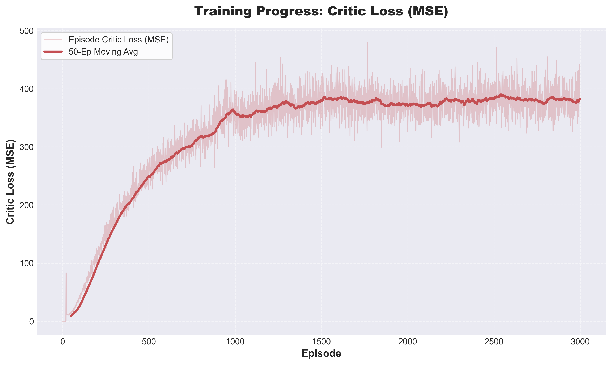
  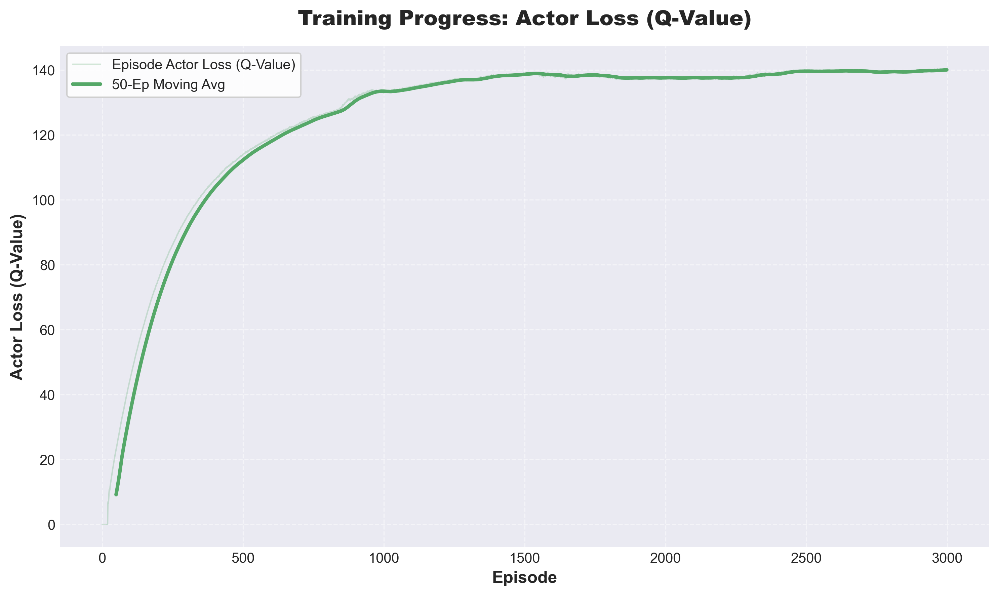
</p>

### Operational view (single step, rendered by the env)

The agent learns to redispatch *away from* generators that overload the bottleneck line. When a raw action would overload line 1–3 (left, ≫100% loading, "CRITICAL: REROUTING FLOW"), the safety layer projects to a feasible setpoint (right, ≤95.9% loading) at the cost of a small redispatch.

<p align="center">
  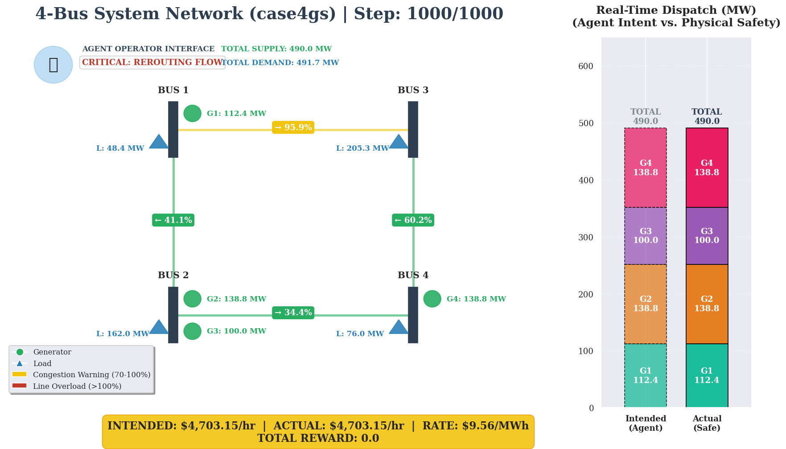
  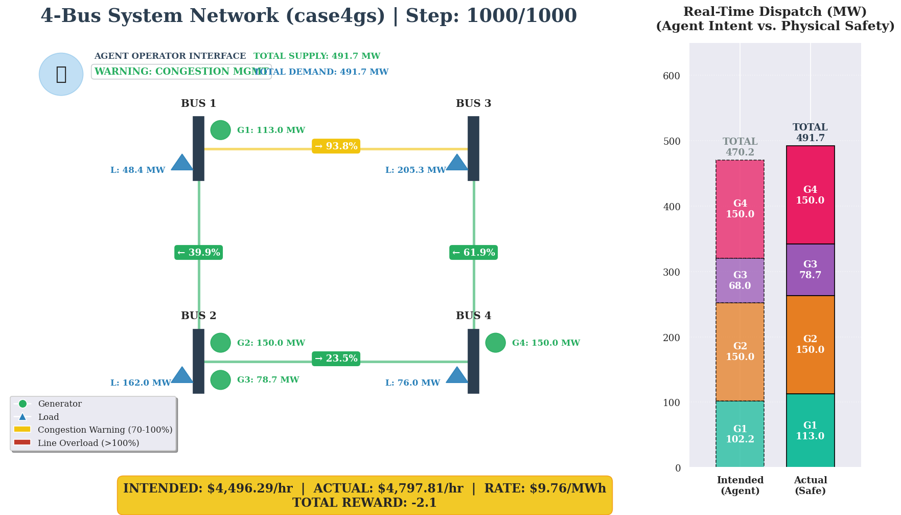
</p>

### 24-step greedy evaluation (one operating day)

The agent's *intended* supply (red) drifts off demand early in the episode, but the safety layer (green) keeps actual supply locked to demand throughout — and unit cost (\$/MWh) settles within ~0.05 \$/MWh of intent.

<p align="center">
  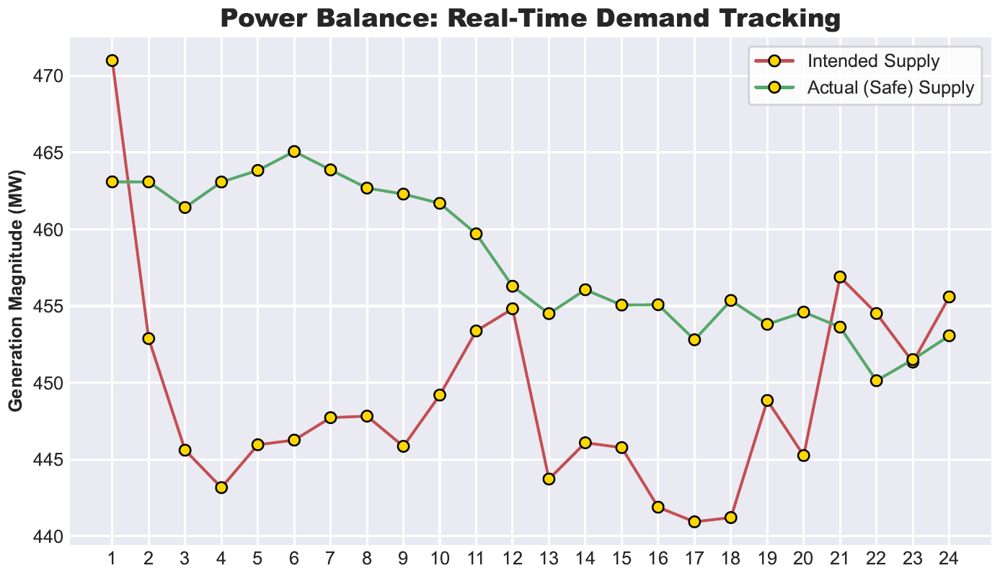
  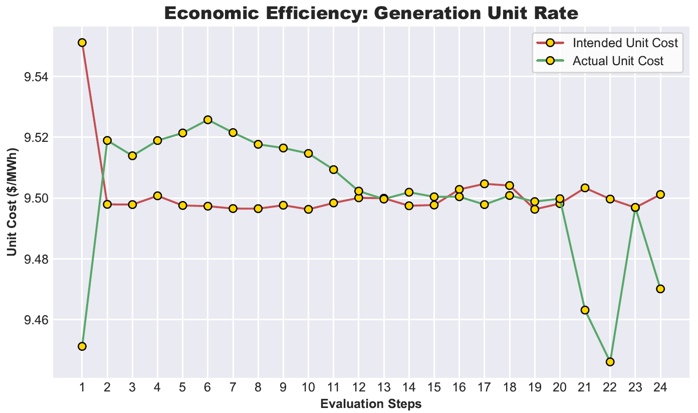
</p>

### 1,000-step benchmark vs. traditional optimization

The RL agent's *actual* (post-projection) supply tracks total demand essentially perfectly, matching the traditional optimizer's trajectory; cost runs ~4% above the optimal lower bound on average; and the speed advantage is dramatic.

<p align="center">
  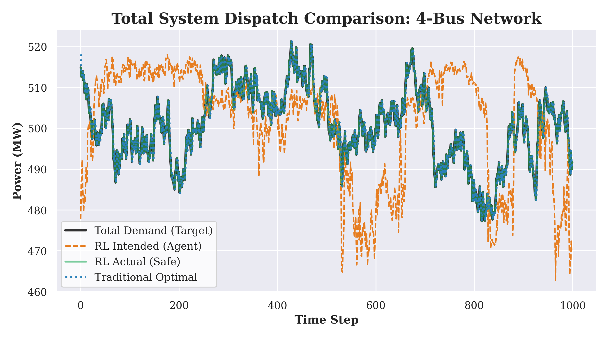
  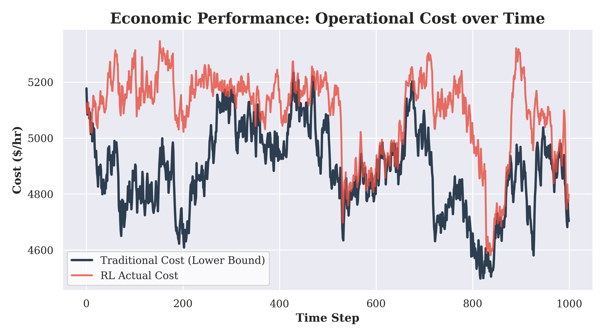
</p>

<p align="center">
  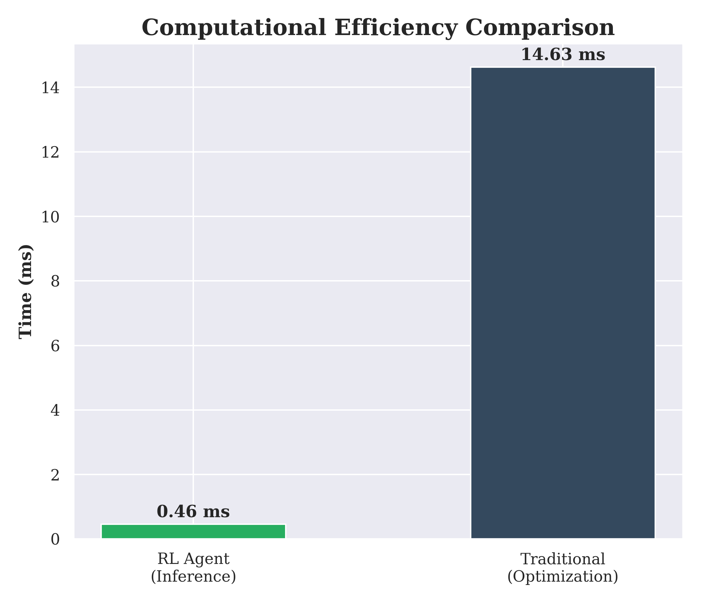
</p>

For full plots, ablations, mismatch histograms, and methodology details see [`report.pdf`](report.pdf) and [`presentation.pptx`](presentation.pptx).

## Repository Layout

```
safe-dispatch/
├── PowerSystemEnv.py            # Gymnasium env: 4-bus DC power flow, PTDF, QP safety layer, render
├── td3_model.py                 # TD3 agent (Actor, Twin Critic, ReplayBuffer)
├── sced_rl_implementation.ipynb # End-to-end notebook: training, evaluation, benchmarks, plots
├── td3_sced_final_model.pth     # Trained model checkpoint
├── report.pdf                   # Final written report
├── presentation.pptx            # Final presentation slides
├── assets/                      # Figures used in this README
├── requirements.txt
├── LICENSE
└── README.md
```

## Installation

Python 3.10+ recommended.

```bash
git clone https://github.com/Syedomershah99/safe-dispatch.git
cd safe-dispatch
python -m venv .venv
source .venv/bin/activate          # Windows: .venv\Scripts\activate
pip install -r requirements.txt
```

GPU is optional — the model is small and trains fine on CPU.

## Usage

### Run the trained agent

```python
from PowerSystemEnv import PowerSystemEnv
from td3_model import TD3Agent

env = PowerSystemEnv()
agent = TD3Agent(state_dim=12, action_dim=4, max_action=1.0)
agent.load("td3_sced_final_model.pth")

obs, _ = env.reset(seed=0)
done = False
while not done:
    action = agent.select_action(obs)
    obs, reward, terminated, truncated, info = env.step(action)
    done = terminated or truncated
    print(f"step={info['step']:3d}  cost=${info['actual_cost']:.0f}/hr  "
          f"violation={info['violation']:.2f}  max_loading={info['max_loading_pct']:.1f}%")
```

### Reproduce training

Open `sced_rl_implementation.ipynb` in Jupyter and run top-to-bottom. The notebook:

1. Builds the system & PTDF, sanity-checks feasibility against a CVXPY/OSQP solver
2. Trains the TD3 agent and saves `training_metrics.csv` + the checkpoint
3. Plots reward, critic/actor loss, and violation curves
4. Evaluates the greedy policy over 24 hours
5. Benchmarks against the traditional QP optimizer (cost, time, mismatch)

### Visualise an episode

```python
env = PowerSystemEnv()
obs, _ = env.reset()
for _ in range(env.max_steps):
    action = agent.select_action(obs)
    obs, r, term, trunc, info = env.step(action)
    env.render(mode="rgb_array")   # frames buffered in env.frames
import imageio
imageio.mimsave("episode.gif", env.frames, fps=2)
```

## Configuration Modes

`PowerSystemEnv` ships in two preset regimes (see the comment block at the top of the class):

- **Benchmark mode** (comparison with the OSQP solver) — `load_drift = 0.05`, `F_max[0] = 1.2`
- **Training / stress test** — `load_drift = 0.20`, `F_max[0] = 1.0` (default)

## Authors

- **Morufdeen Atilola** (50594045)
- **Syed Omer Shah** (50679882) ([@Syedomershah99](https://github.com/Syedomershah99))

Originally produced as a graduate Reinforcement Learning final project (CSE 546, Spring 2026); released here as a standalone, open-source artefact.

## References

- Fujimoto, S., van Hoof, H., & Meger, D. (2018). *Addressing Function Approximation Error in Actor-Critic Methods.* ICML. [arXiv:1802.09477](https://arxiv.org/abs/1802.09477)
- Grainger, J. J., & Stevenson, W. D. (1994). *Power System Analysis.* McGraw-Hill — source of the `case4gs` parameters.
- Stellato, B. et al. (2020). *OSQP: An operator splitting solver for quadratic programs.* Mathematical Programming Computation.
- Diamond, S., & Boyd, S. (2016). *CVXPY: A Python-embedded modeling language for convex optimization.* JMLR.
- Brockman, G. et al. (2016). *OpenAI Gym* — API descendant `gymnasium` is used here.

## License

Released under the MIT License — see [LICENSE](LICENSE).
